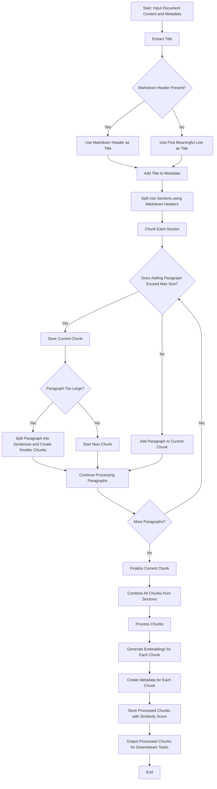

```mermaid
flowchart TD
A[Start: Input Document Content and Metadata] --> B[Extract Title]
B --> C{Markdown Header Present?}
C -->|Yes| D[Use Markdown Header as Title]
C -->|No| E[Use First Meaningful Line as Title]
D --> F[Add Title to Metadata]
E --> F
F --> G[Split into Sections using Markdown Headers]
G --> H[Chunk Each Section]
H --> I{Does Adding Paragraph Exceed Max Size?}
I -->|Yes| J[Save Current Chunk]
J --> K{Paragraph Too Large?}
K -->|Yes| L[Split Paragraph into Sentences and Create Smaller Chunks]
K -->|No| M[Start New Chunk]
I -->|No| N[Add Paragraph to Current Chunk]
L --> O[Continue Processing Paragraphs]
M --> O
N --> O
O --> P{More Paragraphs?}
P -->|Yes| I
P -->|No| Q[Finalize Current Chunk]
Q --> R[Combine All Chunks from Sections]
R --> S[Process Chunks]
S --> T[Generate Embeddings for Each Chunk]
T --> U[Create Metadata for Each Chunk]
U --> V[Store Processed Chunks with Similarity Score]
V --> W[Output Processed Chunks for Downstream Tasks]
W --> X[End]
```
