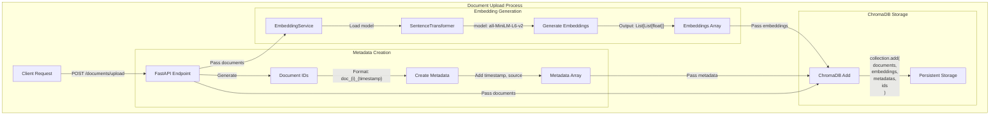

```mermaid
flowchart TD
subgraph "Document Upload Process"
A[Client Request] -->|POST /documents/upload| B[FastAPI Endpoint]
B -->|Pass documents| C[EmbeddingService]

        subgraph "Embedding Generation"
            C -->|Load model| D[SentenceTransformer]
            D -->|"model: all-MiniLM-L6-v2"| E[Generate Embeddings]
            E -->|"Output: List[List[float]]"| F[Embeddings Array]
        end

        subgraph "Metadata Creation"
            B -->|Generate| G[Document IDs]
            G -->|"Format: doc_{i}_{timestamp}"| H[Create Metadata]
            H -->|"Add timestamp, source"| I[Metadata Array]
        end

        subgraph "ChromaDB Storage"
            F -->|Pass embeddings| J[ChromaDB Add]
            I -->|Pass metadata| J
            B -->|Pass documents| J
            J -->|"collection.add(
                documents,
                embeddings,
                metadatas,
                ids
            )"| K[Persistent Storage]
        end
    end
```
